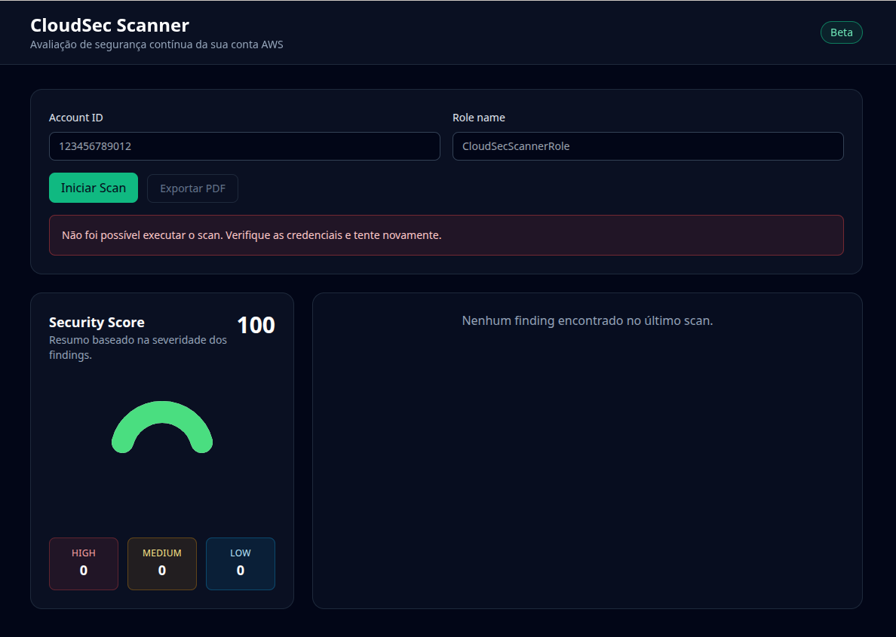

# CloudSec Scanner (v1.2)

Aplicação web para varrer uma conta AWS e destacar riscos de segurança em serviços críticos. O projeto combina um backend FastAPI com boto3 e geração de relatórios em PDF, além de um frontend React com Tailwind e Recharts para visualização dos resultados.

## ✨ Funcionalidades
- Score de segurança calculado a partir da severidade dos findings (High, Medium, Low).
- Categorias avaliadas: IAM, S3, CloudTrail, Network (Security Groups), KMS, EC2 e RDS.
- Exportação do último scan em PDF.
- Cadastro de credenciais por conta AWS e histórico automático dos scans.
- Interface web responsiva com dashboard e gráficos.
- Docker Compose para subir backend e frontend de forma integrada.

## 🖥️ Preview



## 🧱 Estrutura
```
cloudsec-scanner/
├── backend/
│   ├── main.py
│   ├── requirements.txt
│   ├── Dockerfile
│   ├── services/
│   │   ├── iam_check.py
│   │   ├── s3_check.py
│   │   ├── cloudtrail_check.py
│   │   ├── network_check.py
│   │   └── kms_check.py
│   ├── utils/
│   │   └── aws_session.py
│   └── reports/
│       └── pdf_generator.py
├── frontend/
│   ├── package.json
│   ├── Dockerfile
│   └── src/
│       ├── App.jsx
│       ├── main.jsx
│       ├── index.css
│       ├── components/
│       └── pages/
├── docker-compose.yml
└── README.md
```

## 🚀 Como executar com Docker Compose

```bash
cd cloudsec-scanner
docker compose up --build
```

- Backend: http://localhost:8000
- Frontend: http://localhost:3000

> O frontend utiliza a variável `VITE_API_URL` (e mantém `REACT_APP_API_URL` por compatibilidade) apontando para `http://backend:8000`, permitindo que os containers comuniquem-se pela rede interna do Compose.

## ⚙️ Executar localmente (sem Docker)

### Backend
```bash
cd cloudsec-scanner/backend
python -m venv .venv
source .venv/bin/activate  # Windows: .venv\Scripts\activate
pip install -r requirements.txt
uvicorn main:app --reload
```

### Frontend
```bash
cd cloudsec-scanner/frontend
npm install
npm run dev
```

A aplicação estará em http://localhost:3000 e espera o backend em http://localhost:8000.

## 📄 Relatórios
Após executar um scan, utilize o botão "Exportar PDF" para fazer o download de `cloudsec_report.pdf`, gerado a partir dos findings mais recentes.

## 🔐 Credenciais AWS
O backend tenta assumir um role usando `account_id` e `role_name` informados no formulário. Caso contrário, usa as credenciais disponíveis no ambiente (variáveis de ambiente, perfis do AWS CLI, etc.). Defina `AWS_REGION` para ajustar a região padrão.

## 📦 Persistência (v1.2)
- As credenciais cadastradas e o histórico de scans ficam armazenados em um banco SQLite (`data/cloudsec.db` por padrão).
- Defina `DATABASE_URL` para usar outro banco (ex.: PostgreSQL).
- No Docker Compose, o volume `backend-data` persiste os dados entre execuções.

## 🛠️ Endpoints principais
- `POST /credentials` / `GET /credentials` / `DELETE /credentials/{id}` para gerenciar credenciais.
- `GET /credentials/{id}/history` lista os scans realizados com a credencial.
- `GET /history/{scan_id}` retorna o detalhamento (findings) de um scan específico.
- `POST /scan` aceita `credential_id` ou `account_id` + `role_name`.
- `GET /export` gera o PDF do último resultado.

---
Desenvolvido para auxiliar equipes de segurança na avaliação contínua da postura em AWS.
